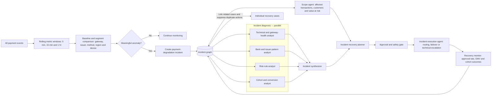

# Event-Driven Revenue Recovery Agent

## 1. Product idea

Build a payments-native recovery agent that turns failed or at-risk revenue events into a controlled recovery loop.

It does more than report a problem. For each case, it:

```text
detects revenue at risk
→ diagnoses the likely reason
→ chooses an approved next intervention
→ executes the intervention through connected systems
→ observes the outcome
→ recovers, escalates, or stops
→ records measured money recovered and a complete audit trail
```

The central premise is that revenue loss rarely happens in one clean step. A payment may fail because of a gateway timeout, an issuer decline, an OTP/authentication issue, a risk rule, an expired card, or a checkout problem. A recovery product must identify where the breakdown occurred and act appropriately, rather than treating all failures as identical.

## 2. Product positioning

This is best positioned as an **AI payment-recovery control plane** or **revenue-recovery orchestration agent**.

Its core focus is money that is already in motion or is clearly due, but is at risk of not being collected:

- a customer attempted a payment and it failed;
- a subscription renewal charge failed;
- a high-intent customer abandoned checkout;
- an issued invoice became overdue.

This is different from an accounting-audit product that reads contracts, invoices, and accounting records to find underbilling, missed fees, or historical billing discrepancies. Those are valid revenue-leakage problems, but they are outside this product's payments-native recovery scope.

```text
Accounting leakage audit:
"We should have billed ₹X, but only billed ₹Y."

Payment recovery agent:
"This ₹X payment should have succeeded or been collected. What is the safest next action?"
```

## 3. Where revenue leaks in the customer-money journey

```text
Customer intent
→ checkout
→ payment attempt
→ authorization / authentication
→ capture and settlement
→ reconciliation
```

Different risks occur at different points:

| Risk type | Where it occurs | Recovery outcome |
|---|---|---|
| Payment degradation | During attempted payments across a cohort | A legitimate payment succeeds; approval performance recovers |
| Checkout abandonment | Before a completed order/payment | Customer returns and completes a paid order |
| Failed subscription recovery | A recurring renewal charge fails | Renewal invoice is paid and subscription is retained |
| Overdue invoice recovery | After a B2B invoice passes its due date | Money is received and reconciled to the invoice |

## 4. Two ways the agent detects risk

The agent is continuously ready, but it does not need to constantly reason about every customer. It is triggered by events and by changes in aggregate payment performance.

### A. Event-driven: one individual case

An event occurs and opens one recovery case.

```text
payment_failed webhook
subscription_renewal_failed webhook
checkout session inactive beyond defined threshold
invoice passes its due date
```

Examples:

- A subscription renewal receives an insufficient-funds decline. A case opens immediately.
- A payment provider reports an OTP/authentication failure. A case opens immediately.
- A customer begins checkout but has no further activity or purchase after, for example, 20 minutes. The checkout becomes an abandonment case.
- An invoice reaches its agreed due date without a matched payment. A scheduled check opens an overdue-invoice case.

Checkout abandonment is usually **near-real-time**, not instant. The system must wait for an agreed inactivity/session-expiry threshold before deciding that the customer has genuinely left.

### B. Incident-driven: one shared issue across many cases

The system detects a meaningful pattern, such as a payment success/approval rate dropping or a failure rate rising for a particular segment.

```text
payment success rate drops for a gateway, issuer, payment method, device, or region
→ create a payment-degradation incident
→ identify common cause
→ take an approved system-level action
→ monitor recovery
```

Example:

```text
HDFC card approval rate through Gateway A falls sharply
→ affected transactions are grouped into one incident
→ evidence indicates gateway/issuer timeout pattern
→ eligible traffic is routed to an approved backup path
→ eligible failed attempts are retried once
→ recovered GMV and approval-rate recovery are measured
```

The same failed payment can belong to an individual recovery case and a broader incident. The platform must coordinate them so that it does not send duplicate communications or retry the same payment unnecessarily.

## 5. Shared recovery loop

Every use case should run through the same high-level state machine.

```text
1. Detect
   An event or performance anomaly indicates revenue at risk.

2. Create and deduplicate a case
   Link the right customer, order, subscription, invoice, payment attempt, and incident.
   Prevent multiple agents from acting on the same obligation independently.

3. Gather context
   Retrieve safe, relevant evidence: failure codes, payment method, transaction history,
   checkout stage, subscription state, invoice status, customer communication history,
   gateway health, and policy constraints.

4. Diagnose
   Classify the cause and confidence level. Determine whether the issue is individual,
   shared, technical, customer-actionable, or requires a human.

5. Choose the next approved action
   Select from a policy-controlled action library, based on cause, probability of recovery,
   customer state, value at risk, and allowed limits.

6. Execute
   Perform the action through a gateway, billing system, checkout, CRM, communication
   channel, or internal escalation workflow.

7. Observe and verify
   Listen for a payment success, retry outcome, customer response, promise-to-pay,
   dispute, checkout completion, or external incident resolution.

8. Continue, escalate, or stop
   Re-evaluate the case. Schedule an eligible next attempt, hand off to a person, or
   close the case according to explicit stopping rules.

9. Reconcile and measure
   Confirm that money was actually collected and linked to the right order/invoice.
   Record the evidence and outcome.
```

## 6. Example recovery playbooks

### Payment failure and payment degradation

Potential causes:

- gateway/API timeout or outage;
- issuing-bank decline;
- OTP/3DS authentication failure;
- insufficient funds;
- expired or invalid card/token;
- fraud/risk-rule rejection;
- unsupported payment method, device, currency, or region.

Potential interventions:

- retry after a reason-appropriate delay;
- reroute eligible payments to an approved gateway/acquirer;
- ask the customer to complete authentication;
- offer or preselect an alternate payment method;
- send a secure payment-update link;
- open a technical incident or route it to payment operations;
- stop and request human review for uncertain, risky, or high-value cases.

Important rule: a hard decline, fraud block, or repeated failure should not trigger endless retries.

### Checkout abandonment

Potential causes:

- checkout bug, slow page, or broken field;
- shipping, tax, delivery date, or final price surprise;
- coupon issue;
- unavailable preferred payment method;
- customer distraction or uncertainty;
- an attempted payment failure that led the customer to leave.

Potential interventions:

- preserve the cart and generate a secure return-to-checkout link;
- fix or bypass a known checkout friction point;
- present an eligible alternative payment method;
- send a permitted recovery reminder via the correct channel;
- route high-value cases to customer support;
- create a shared technical incident if many users abandon the same step.

If the customer attempted a payment and it failed, the case should be routed into payment recovery rather than receiving conflicting generic cart-abandonment messages.

### Failed subscription renewal

Potential causes:

- insufficient funds;
- expired/replaced card;
- issuer decline;
- off-session authentication requirement;
- invalid payment token;
- intentional customer cancellation.

Potential interventions:

- schedule a smart retry if the decline is eligible;
- send a secure update-payment or authentication link;
- offer an approved alternative payment method;
- apply the product's grace-period and service-access rules;
- stop recovery when the customer cancels, pays, opts out, or reaches the retry limit.

Success means the renewal invoice is paid **and** the subscription is correctly retained. It does not mean merely sending a payment-update email.

### Overdue B2B invoice

Potential causes:

- invoice not received by accounts payable;
- wrong contact, amount, tax detail, or legal entity;
- missing PO number;
- delivery/service acceptance issue;
- dispute;
- delayed approval or customer cash-flow issue;
- payment received but not reconciled.

Potential interventions:

- send the invoice/reminder to the correct approved contact;
- collect missing PO/approval information;
- route disputes to the account or service team;
- record and monitor a promise-to-pay;
- follow an approved escalation path;
- apply credit hold, late fee, or collections handoff only where contract and policy allow.

A promise-to-pay is useful evidence, but it is not recovered money. Recovery is complete only when funds are received and reconciled against the invoice.

## 7. Bounded recovery: safety, policy, and trust

The agent is not allowed to improvise unlimited actions. It works within explicit policies and an approved action library.

### Required stopping rules

Stop or change route when:

- the payment succeeds;
- the obligation is cancelled, refunded, or already resolved;
- a customer opts out of communication;
- the customer disputes the charge or invoice;
- the maximum retries or communication attempts are reached;
- an action needs a human approval;
- confidence in the diagnosis is too low;
- a regulatory, contractual, or customer-policy limit applies.

### Core safeguards

- idempotency and duplicate-charge prevention;
- retry limits and reason-aware retry timing;
- message/contact frequency limits;
- consent and channel-policy checks;
- secure payment links rather than collecting raw payment details;
- human approval for high-impact changes, such as broad routing changes or major incentives;
- a clear separation between technical errors, fraud signals, customer disputes, and normal declines.

## 8. Evidence, measurement, and audit trail

The product must show more than activity metrics such as “messages sent” or “cases analysed.” It must prove financial outcomes.

For each case or incident, preserve:

- trigger and timestamp;
- linked payment/order/subscription/invoice identifiers;
- evidence used for diagnosis;
- diagnosis and confidence;
- action selected and the policy rule that allowed it;
- executed action, timestamp, and relevant external result;
- human approvals or escalations;
- terminal state: recovered, unrecoverable, cancelled, disputed, or escalated;
- payment/settlement/reconciliation evidence;
- money at risk and actual money recovered.

Important metrics include:

- amount of revenue at risk;
- recovered GMV / cash collected;
- recovery rate by cause, channel, gateway, issuer, or payment method;
- approval-rate change after an incident action;
- retained subscription MRR and involuntary churn prevented;
- overdue amount resolved and aging reduction;
- time to recovery;
- action cost and customer-contact volume.

For honest measurement, the platform compares results with a baseline or holdout cohort where practical. A payment that succeeds later is not automatically proof that the agent caused the recovery.

## 9. What makes the product stronger than a dashboard-only demo

A basic demo may ingest a batch of failures, classify them, recommend actions, and display revenue-at-risk/recovered metrics. That is a useful starting point.

The stronger product is both **event-driven and incident-driven**:

```text
Individual failure
→ immediate, case-level recovery loop

Shared payment-performance issue
→ incident-level diagnosis and recovery loop
```

Its differentiation is not simply “AI.” It is:

- diagnosis across payment, checkout, customer, billing, and incident signals;
- explainable next-best action selection;
- real execution through approved connectors;
- policy boundaries and stopping rules;
- coordination across individual cases and broad incidents;
- verified, incremental financial recovery with an audit trail.

## 10. Complete product operating model

The product supports the complete recovery domain through one shared operating model. Every recovery type uses the same case engine, policy layer, execution framework, measurement model, and audit trail, while retaining a playbook appropriate to its source of loss.

| Recovery domain | Case-level recovery | Incident-level recovery |
|---|---|---|
| Payment failure | Recover one failed payment through the right retry, reroute, authentication, or payment-update action | Detect and resolve a shared drop in approval performance by gateway, issuer, method, region, or device |
| Checkout abandonment | Rescue one high-intent checkout through a saved cart, friction fix, payment option, or permitted outreach | Detect and resolve a common drop-off point, such as a broken field, slow page, or unavailable method |
| Subscription failure | Retain one subscriber through reason-aware dunning, update flows, and grace-period management | Detect systematic renewal failures for a plan, payment method, bank, or billing configuration |
| Overdue invoice | Resolve one receivable through contact correction, dispute routing, reminders, promise-to-pay tracking, and policy-based escalation | Detect systemic invoicing, delivery, or collections bottlenecks across an account segment |

The architecture therefore needs to serve two complementary modes at all times:

1. **Individual case recovery** — the immediate recovery loop for a specific payment, checkout, subscription, or invoice.
2. **Incident recovery** — the cohort-level loop for a shared degradation or bottleneck affecting many cases.

## 11. Agent-system architecture

This is not a strict top-to-bottom hierarchy of autonomous agents. It is an **event-driven agent mesh** with a shared case graph, evidence board, policy state, and audit ledger.

The trigger and case router is the entry point, not the intelligence “boss.” It creates the correct case or incident, publishes a work package, and the relevant specialist agents work in parallel against the same governed evidence. Every agent returns structured findings; only one approved action plan is allowed to execute.

```text
Parallel agents can investigate and propose.
Only one policy-approved plan can execute.
```

### Individual recovery case mesh

```mermaid
flowchart LR
    subgraph S["Revenue event sources"]
        P["Payment gateway / PSP webhooks"]
        C["Checkout behaviour events"]
        B["Subscription billing events"]
        I["Invoice / AR events"]
        H["Gateway, bank and system-health signals"]
    end

    S --> E["Event bus and schema normalizer"]
    E --> R["Trigger and case router"]
    R --> G[("Shared case graph")]
    G <--> X[("Evidence board and entity context")]
    G <--> L[("Case state, policy state and action history")]

    R --> PF
    R --> ID
    R --> CH
    R --> FR
    R --> DM
    R --> IC

    subgraph D["Diagnosis squad — selected per case and run in parallel"]
        PF["Payment and gateway forensics"]
        ID["Issuer and decline-code analyst"]
        CH["Customer and payment-history analyst"]
        FR["Fraud and risk analyst"]
        DM["Domain specialist: checkout, subscription or invoice"]
        IC["Active-incident correlation agent"]
    end

    X --> PF
    X --> ID
    X --> CH
    X --> FR
    X --> DM
    X --> IC

    PF --> DS["Diagnosis synthesizer"]
    ID --> DS
    CH --> DS
    FR --> DS
    DM --> DS
    IC --> DS

    DS --> RH["Ranked root-cause hypothesis: evidence, confidence and affected entities"]
    RH --> PR
    RH --> CR
    RH --> OR
    RH --> RE
    L --> PC

    subgraph Q["Intervention squad — parallel candidate plans"]
        PR["Payment recovery strategist: retry, reroute or alternate method"]
        CR["Customer recovery agent: authentication, update link or outreach"]
        OR["Operational remediation agent: incident, support or configuration action"]
        RE["Recovery economics agent: value, probability, cost and priority"]
        PC["Policy pre-check agent: allowed actions and constraints"]
    end

    PR --> PD["Plan director"]
    CR --> PD
    OR --> PD
    RE --> PD
    PC --> PD

    PD --> PG["Hard policy gate: vetoes, limits and approvals"]
    PG --> EX["Controlled execution agent"]
    EX --> V["Outcome verifier and reconciliation agent"]

    V --> G
    V --> AL[("Recovery ledger and audit trail")]
    V --> HC["Human console: approve, inspect or intervene"]
```



### Agent responsibilities and communication rules

| Component | Responsibility | What it publishes |
|---|---|---|
| Trigger and case router | Normalizes an event, identifies the case type, deduplicates it, and creates the case | Case identifier, event type, entity references, priority, and work package |
| Diagnosis squad | Investigates different possible causes in parallel | Evidence-backed observations, root-cause hypotheses, confidence, and relevant constraints |
| Diagnosis synthesizer | Combines evidence and ranks competing explanations | Ranked root-cause hypothesis, unresolved uncertainty, and recommended planning context |
| Intervention squad | Produces alternative recovery strategies in parallel | Candidate actions/sequences, expected recovery value, cost, customer risk, and dependencies |
| Plan director | Selects one coherent action sequence | Versioned recovery plan with branches and stop conditions |
| Policy gate | Enforces deterministic boundaries | Allowed, blocked, or human-approval-required decision with reason |
| Execution agent | Performs only the approved plan through connected systems | Idempotent action record, external result, and timestamp |
| Verifier and reconciler | Confirms outcome and chooses the next case state | Recovered/failed/disputed/escalated status and financial evidence |

The router selects a **domain work package**, not a single winning agent. For example, a payment-failure case can call gateway, issuer, customer-history, fraud, and incident-correlation specialists. A checkout case instead calls funnel/UX, payment-method, cart/value, and customer-engagement specialists.

All agents access the governed case state by reference. The system should not copy an uncontrolled, full customer history into every prompt. Each agent receives the specific identifiers and permissions it needs, retrieves relevant facts through approved tools, and publishes only structured evidence back to the shared evidence board.

### Parallel reasoning, sequential execution

The following work can happen in parallel:

- evidence gathering and competing root-cause hypotheses;
- recovery-probability, value, cost, and customer-risk estimation;
- payment, customer-communication, and operational recovery proposals;
- incident correlation and duplicate-action suppression.

The following must be sequential and controlled:

```text
Synthesize diagnosis
→ choose one coherent recovery plan
→ validate policy and permissions
→ execute an idempotent action
→ observe outcome
→ verify/reconcile
→ recover, retry, stop, or escalate
```

Without this separation, parallel agents could retry the same payment, send conflicting customer messages, and change routing simultaneously.

### Payment-degradation incident mesh

A sudden payment success/approval-rate drop is not one external webhook. It is an internal event created by continuously analysing the incoming payment stream. The stream system evaluates rolling time windows and compares each segment with its baseline. A meaningful deviation emits an `approval_rate_anomaly` event, which creates a payment-degradation incident.



Individual cases and incidents operate together. If a gateway outage is active, a case agent can join the incident rather than independently retrying and messaging every affected customer. If the incident does not explain a particular payment failure, the individual case continues on its own recovery plan.

## 12. Short product narrative

> When revenue is at risk, our agent does not stop at an alert. It detects the failure, understands what went wrong, selects the safest approved intervention, executes the recovery workflow, and proves whether money was actually recovered—while respecting retries, consent, escalation, stopping rules, and audit requirements.
