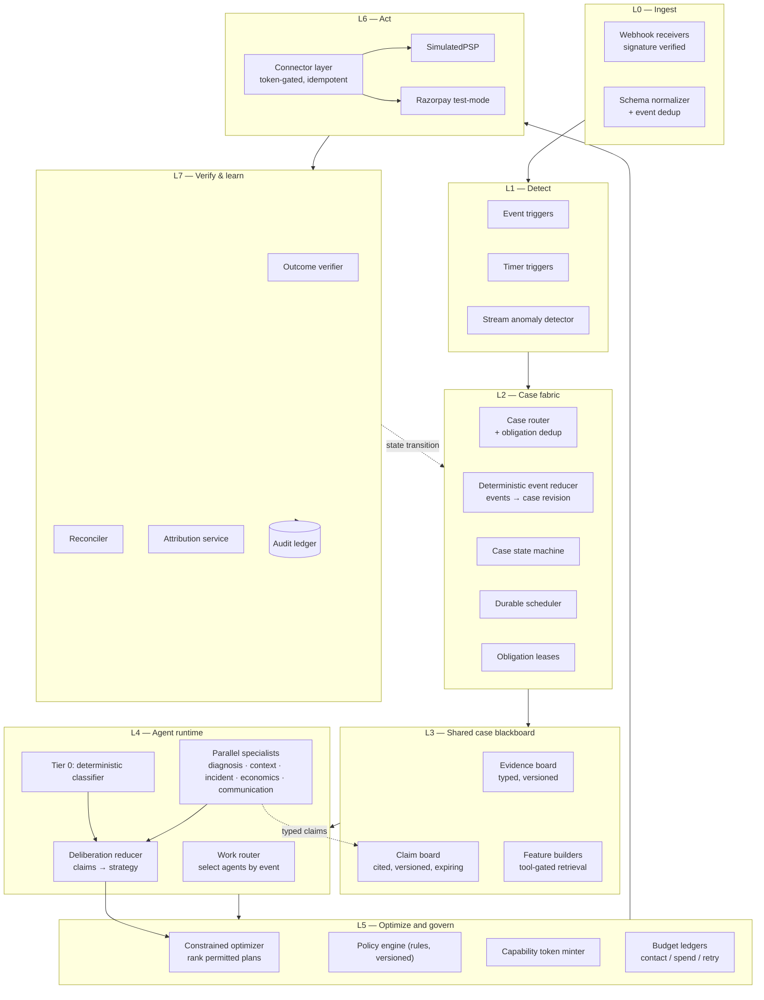
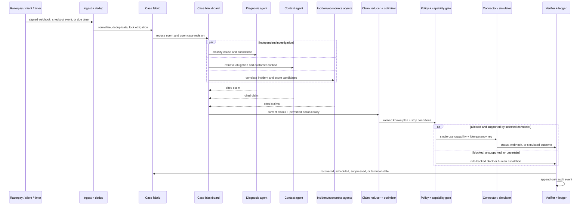
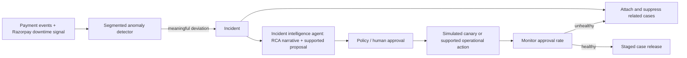
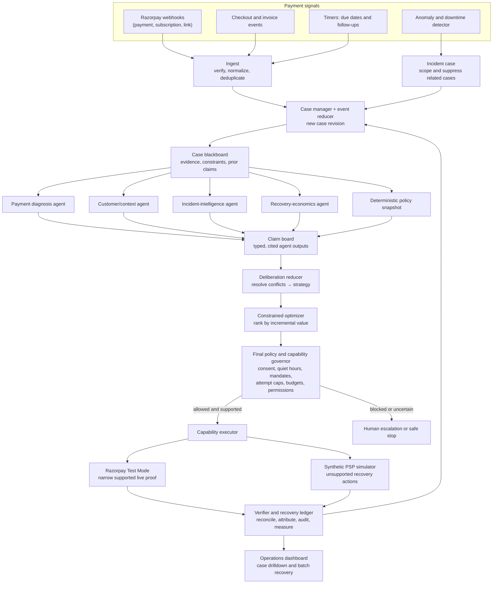

# Revenue Recovery Agent — Architecture v2

**Track:** Razorpay Buildathon, Track 03 — AI Revenue Recovery
**The bar:** measured money recovered across a batch, with compliant escalation, stopping rules, and an audit trail.
**Supersedes:** `payment-recovery-agent-concept.md` (v1)
**LLM implementation:** an `LLMProvider` interface; `OpenAIResponsesProvider` is the first adapter. Razorpay Test Mode is used only for explicitly supported live actions.

---

## 0. What changed from v1

| # | v1 | v2 |
|---|---|---|
| 3a | ~20 loosely defined LLM agents; decline-code analysis, fraud scoring, incident correlation all modelled as agents | **A case blackboard, parallel specialist roles, a claim reducer, and a constrained optimizer.** Tier 0 resolves ~80% of cases; only ambiguous work invokes an LLM provider |
| 3b | Policy gate sits between plan selection and executor | **Capability tokens.** The gate is the only minter; connectors refuse unsigned calls. Unbypassable by construction |
| 3c | No scheduler anywhere in the design | **Durable scheduler (L2)** is a first-class component — leased, idempotent, cancellable, virtual-clock aware |
| 3d | "idempotency" and "coordinate" asserted | **Obligation lease + idempotency keys + contact-budget ledger + incident attachment**, all specified |
| 3e | Incident parks cases, resumption unspecified | **Release controller** with ramp, jitter, and circuit breaker; reroute gets canary + auto-rollback + TTL |
| 3f | "Rolling windows vs baseline" | **Seasonal per-segment baselines**, volume floor, two-proportion z-test, dwell, BH correction, auto-close, child-segment suppression |
| §4 | Global card vocabulary; Razorpay unmentioned | **India rails first-class**: UPI AutoPay, e-NACH, RBI e-mandate, AFA, pre-debit notification, DLT/TRAI, WhatsApp windows, Razorpay APIs |
| §5 | Attribution is one paragraph | **Attribution service** with stratified holdout and an incremental-recovery estimator as the headline metric |
| §4 implementation | Anthropic-specific SDK, model names and cache controls | **Provider-neutral agent runtime** with strict structured claims; OpenAI Responses API is the initial provider adapter |

---

## 1. Design principles

1. **Thin agents, thick policy.** An agent owns a narrow question, scoped evidence, permitted tools, and a typed claim contract. A model is optional implementation detail inside that role. Everything a lookup table can answer stays deterministic, cheap, and replayable.
2. **Shared facts, not chained prompts.** Agents read and write versioned claims on a case blackboard. They do not pass an unbounded conversation from one agent to another.
3. **Parallel proposal, serial execution.** Independent specialists investigate concurrently and fan in through a reducer; exactly one policy-approved plan executes against an obligation.
4. **Money moves only through a minted capability.** Not "an agent said so" — the connector physically cannot act without a signed, single-use token.
5. **Time is a first-class dependency.** Everything is scheduled: retries, chases, escalations, parks. The scheduler is infrastructure, not an afterthought.
6. **A rupee is only recovered when it is both collected and attributable.** Gross recovery is reported; incremental recovery against a holdout is the headline.

---

## 2. Layered architecture

This is a case-driven multi-agent system, not an autonomous swarm. The case fabric controls lifecycle and side effects; the agent runtime provides bounded parallel deliberation over a shared blackboard.



**The loop matters.** L7 writes an outcome event back to L2. The deterministic event reducer creates a new case revision, invalidates only stale claims, and the work router reruns only the specialists affected by that event. It is reactive, rather than a one-shot plan.

---

## 2a. Executable workflows

The product is agentic in **bounded deliberation**, but not in uncontrolled execution. Specialists may run in parallel; the reducer and optimizer select one strategy; the policy engine and connector decide whether anything external happens.



An incident uses the same case fabric. It does **not** independently retry every affected obligation.



## 2b. Agent runtime: parallel specialists, reducer, and optimizer

The “agents” are specialist roles with separate tool scopes and output schemas. They share the same versioned case blackboard; they do not hand work to one another through an open-ended chat.



Each role declares the evidence kinds it consumes:

```ts
interface RoleContract {
  role: RoleId
  dependsOn: EvidenceKind[]      // drives claim invalidation
  toolScope: ToolId[]
  claimSchema: JSONSchema
  timeoutMs: number
  callBudget: number
  cacheKey: (input: RoleInput) => string
}
```

The work router derives the rerun set from `dependsOn`: when a new revision changes evidence of kind `K`, every claim whose role declares `K` is invalidated and only those roles rerun. Invalidation is therefore derived from the registry rather than hand-maintained, and the surviving claims are reused as-is. This is what makes the Phase 2 acceptance criterion — an inbound reply invalidates context and communication but not diagnosis, incident or economics — a property of the registry rather than a special case in the router.

There are two different reducers:

1. **Event reducer (deterministic):** reduces the ordered event log into the current `CaseState`. It makes replay and selective re-evaluation possible.
2. **Deliberation reducer (structured):** combines parallel agent claims, detects conflicts and missing evidence, and chooses a strategy. It uses deterministic rules for clear cases and may call an LLM provider only for genuine ambiguity.

The optimizer then maximizes:

`expected incremental recovery − action cost − model cost − customer/risk penalty`

subject to hard policy constraints. The optimizer cannot select a novel action: it ranks only action-library candidates proposed by specialists and permitted by the policy snapshot.

**Safety boundary:** The LLM provider can help an agent interpret evidence, resolve conflicting claims, or draft approved copy. It cannot mint a capability token, bypass policy, invoke a connector, or declare a payment recovered. Those decisions remain deterministic, logged, and independently verified.

---

## 3. The decision ladder (fix 3a)

Every case enters at Tier 0 and escalates only if it must.

| Tier | Handles | Mechanism | Expected share | LLM cost |
|---|---|---|---|---|
| **Tier 0 — Resolve** | Known failure code, known rail, unambiguous policy | Decline taxonomy lookup → playbook → plan | ~75–85% | zero |
| **Tier 1 — Deliberate** | Unmapped code, conflicting evidence, multiple viable plans, customer reply to interpret | Fan out specialist work → reduce typed claims → optimize a known action library | ~12–20% | 0–4 calls |
| **Tier 2 — Escalate** | Low confidence, high value, novel action, policy requires approval | Human queue with expiry | ~3–5% | zero |

### Why this is the stronger AI story

The obvious question from a judge is *"why does this need agents at all?"* The answer is that a recovery case combines independent payment, customer, incident, economics, and compliance evidence. The ledger records each specialist's claims, the reducer's conflict resolution, and the optimizer's rejected alternatives, so the demo can state **"parallel investigation changed the outcome on N cases — here are three replays"**, rather than asserting intelligence.

It also makes the audit trail reproducible. A Tier 0 decision cites a rule ID; replaying the ledger yields the identical plan. Tier 1 records the exact claims, model/provider metadata when used, reducer input, and optimizer score so its non-deterministic portion is inspectable and cacheable.

### What is deterministic (no model)

| Component | Implementation |
|---|---|
| Decline-code → cause + retry eligibility | Taxonomy table, per rail |
| Retry schedule | Rule: `(rail, code, attempt_no) → delay` |
| Fraud / risk gate | Threshold on the score you already have |
| Incident correlation | Segment/issuer/rail graph query on the incident index |
| Candidate generation and recovery economics | Action library + `p_recover × value − action_cost − model_cost − risk_penalty` |
| Policy evaluation | Rules engine over case + customer + merchant config |
| Attribution | Two-proportion statistics |
| Contact eligibility | Budget ledger + consent + quiet-hours check |

---

## 4. Agent runtime and LLM provider adapter

An **agent** is defined by its job, tool scope, evidence scope, claim schema, timeout, cost budget, and evaluation—not by the model vendor. The runtime invokes an LLM only when that agent cannot close its question deterministically.

| Specialist | Primary responsibility | Deterministic first path | Optional LLM work | Claim output |
|---|---|---|---|---|
| **Payment diagnosis** | Explain why collection failed | Rail/code taxonomy | Reconcile conflicting or unmapped evidence | ranked causes + confidence + evidence refs |
| **Customer/context** | Establish obligation, history, and intent | feature retrieval and policy facts | interpret an inbound reply | context facts or intent enum |
| **Incident intelligence** | Detect shared failure and protect cases | segmented graph/baseline query | RCA narrative for an opened incident | incident/suppression recommendation |
| **Recovery economics** | Generate and value viable actions | action library + expected-value scoring | none in P1 | candidates + score components |
| **Communication** | Render allowed customer copy | approved template selection | fill allowed slots only | template slots or safe reply class |
| **Deliberation reducer** | Turn claims into a strategy | precedence, confidence, and conflict rules | resolve material conflict only | selected strategy + rejected alternatives |

`OpenAIResponsesProvider` is the initial implementation of `LLMProvider`. It uses the OpenAI Node SDK and Responses API with strict JSON Schema. Model IDs (for example, Terra for analysis and Luna for short structured extraction) remain configuration, not architecture; the ledger records the actual provider, model, effort, latency, and usage for every invocation.

### Provider request contract

- The OpenAI adapter uses `openai.responses.create()` with `text.format: { type: "json_schema", ... }`; reject any response that fails schema validation.
- Keep stable instructions, the sorted action library, policy summary, and decline taxonomy first. Put case-specific evidence last.
- Use a stable `prompt_cache_key` per specialist role and record provider cache telemetry in the ledger.
- Keep the LLM stateless per case unless a bounded follow-up genuinely needs its prior response. Case state lives in the database and evidence board, not in chat history.
- Store response ID, model, schema version, latency, usage, and validation result. Store prompt hashes and redacted inputs, not raw PII.

### Prompt-injection posture

The customer/context and communication roles may touch untrusted text — inbound emails, WhatsApp replies, promise-to-pay messages. The rules:

- Inbound customer content is **data, never instruction**. It cannot lift a retry cap, unlock an action, change a policy, or alter the plan.
- The reply-interpreter claim returns an **enum plus extracted fields**. It has no tool access and cannot emit an action. Its output is fed into the deterministic policy engine, which decides what happens.
- The communication claim fills **slots in an approved template**. It cannot author a free-form message, add a link, or change the recipient.
- Webhook signatures are verified at L0. A spoofed `payment_failed` is otherwise a free way to make the agent contact arbitrary customers.

### Degraded mode

If the model is unavailable or rate-limited, the case uses Tier 0 **only when an explicit, policy-allowed playbook exists**. Otherwise it moves to human escalation or a stopped-safe state. A model outage must never manufacture a generic recovery action. The ledger records `degraded: true` either way.

---

## 5. Governance: capability tokens (fix 3b)

A gate that only sits between the reducer/optimizer and the executor is advisory — anything holding a connector can route around it. So the gate is moved into the connector's admission check.

**The policy engine is the only minter.** Deterministic code, never a prompt.

```
CapabilityToken {
  case_id, obligation_id, action_id,
  params_hash, attempt_no,
  amount_cap, currency,
  policy_version, rule_id,
  not_after,             // short expiry
  nonce,
  hmac                   // signed with the gate's key
}
```

Connector admission, in order:

1. Verify HMAC and expiry.
2. Check `action_id` matches the call, and `params_hash` matches the actual params.
3. Check `amount ≤ amount_cap`.
4. **Burn the nonce** — insert into `token_burns` with a unique index. A duplicate insert means replay: reject.
5. Execute.

Steps 4 and 5 give idempotency and single-use enforcement from the same mechanism. The sentence this buys on stage: *"the agent cannot move money the policy engine did not authorise — not because it was instructed not to, but because the connector will not accept the call."*

**Approval expiry.** A Tier 2 case that no human touches within the SLA expires to `stopped_awaiting_human`. Never expire-and-execute.

---

## 6. Durable scheduler (fix 3c)

The whole product is time-based — retry at T+3, chase at T+7, escalate at T+14, park during an incident, resume after. This is the component most likely to break in a live demo, and it was absent from v1.

```sql
scheduled_actions (
  id, case_id, obligation_id,
  fire_at,                        -- virtual clock
  action_ref,
  state,                          -- pending | leased | done | cancelled
  lease_owner, lease_expiry,
  attempts, created_at
)
```

Tick worker:

```sql
SELECT * FROM scheduled_actions
WHERE state = 'pending' AND fire_at <= :now
ORDER BY fire_at
FOR UPDATE SKIP LOCKED
LIMIT 50;
```

- **Leased dispatch, not magical exactly-once I/O**: database lease acquisition and terminal writes are transactional. An external connector call is at-least-once and must carry an idempotency key; after a crash, an `in_flight` attempt is reconciled before it can be retried.
- **Cancellable**: any terminal case transition cancels every pending row for that case in the same transaction. This is how a payment that succeeds on its own stops the dunning sequence.
- **Virtual clock**: `now` comes from a `Clock` interface. In production it is wall time; in the demo it is a controllable counter. This is what makes a 14-day dunning sequence run in 90 seconds on stage.

---

## 7. Idempotency and arbitration (fix 3d)

### The obligation is the unit of money

Not the case, not the customer. One obligation = one thing owed: a subscription cycle, an invoice, an order. Multiple cases and incidents may reference it; exactly one may act on it at a time.

### Obligation lease

The lease is acquired at **execution admission**, not at deliberation fan-out. Specialists are read-only over a blackboard snapshot, so they need no lease; taking one before a provider call would let a slow role hold the obligation, and a lease expiring mid-call would let a second worker act on the same obligation. The executor acquires the lease, revalidates that the plan still matches the current case revision, and only then presents the capability token.

Any actor must hold `obligation_lock(obligation_id, holder, expiry)` to execute. Fixes the v1 §4 race directly: `payment_failed` opens a case, the 20-minute abandonment timer fires and would open a second — but the dedup key is the **order/session**, not the customer, and the second case attaches to the first rather than opening.

### Idempotency key

```
idem_key = sha256(case_id | action_id | attempt_no | params_hash)
```

Written to `action_attempts` with a unique index **before** the external call; the response is written back after. On restart, any row still `in_flight` is reconciled by querying the PSP with the same key rather than re-issuing. This is what prevents a crash between call and response from double-charging.

### Contact budget ledger

Keyed `(customer_id, channel, window)`, decremented atomically, and — critically — **shared across every case and every incident**. This is the mechanism v1 gestured at when it worried about duplicate communications. Caps:

- per-channel per-window (e.g. 2 SMS / 7 days)
- global across channels per customer
- quiet hours (see §9)

### Incident attachment

A case joining an incident enters `suppressed_by_incident`. The **incident**, not the case, owns resumption. The case's pending scheduled actions are cancelled and re-created by the release controller on resume.

---

## 8. Incident mode

### 8a. Anomaly detection (fix 3f)

Naive rolling-window-vs-baseline fires on mix shift: a marketing push changes the issuer mix, aggregate approval rate drops, nothing is actually broken. The detector needs:

| Element | Specification |
|---|---|
| Segment key | `(gateway, method, issuer/bank, region, device)`, evaluated hierarchically |
| Baseline | Same weekday + hour, trailing 4 weeks, **per segment** — captures seasonality |
| Volume floor | `n ≥ 30` in window; below that, no test |
| Test | One-sided two-proportion z-test vs baseline; CUSUM in parallel for slow drift |
| Dwell | Must persist 2 consecutive windows before opening (hysteresis) |
| Multiplicity | Benjamini–Hochberg across the segment set — you are running hundreds of tests per tick |
| Child suppression | If a parent segment explains the drop, do not open child incidents |
| Auto-close | Rate within X% of baseline for 3 consecutive windows |

Razorpay also emits `payment.downtime.started` / `.resolved` webhooks — a real external signal to fuse with the internal detector, and a nice authenticity beat in the demo.

### 8b. Staged release and canary (fix 3e)

The failure v1 invites: a thousand parked cases resume at once against a gateway that just recovered, re-degrading it — and the detector fires again. Self-inflicted oscillation.

**Release controller:**
- Token-bucket resumption with jitter.
- Ramp `5% → 15% → 40% → 100%`, each step gated on live approval rate holding ≥ X% of baseline over a rolling window.
- Circuit breaker re-parks if the rate drops during ramp.

**Reroute action** — high blast radius, so it needs more than human approval:
- Canary percentage first.
- Automatic rollback if the backup path underperforms the primary.
- Kill switch.
- **TTL on the routing override** so nothing becomes permanent by forgetting.

---

## 9. India rails and compliance

This is where the track is judged and where v1 was silent — the word "Razorpay" did not appear in it once.

### Rails and their failure modes

| Rail | Distinctive failures | Retry semantics |
|---|---|---|
| Cards | Issuer decline, 3DS/OTP failure, expired card, invalid token | Soft vs hard decline; per-code ceilings; network rules limit retry counts and penalise excess |
| UPI collect / intent | Request expired, payer unavailable, PSP timeout | Short retry window; user must be present |
| **UPI AutoPay** | Mandate paused/revoked, balance insufficient, amount cap exceeded, payer app down | **Pre-debit notification required ≥24h before debit** |
| **e-NACH / e-mandate** | Mandate not active, presentation rejected, insufficient funds | Bank working-day presentation cycles; **no retry on revoked mandate** |
| Netbanking | Bank downtime, session expiry | Reroute, not retry |
| Wallets | Insufficient balance, KYC limit | Alternate method |
| Smart Collect (virtual accounts) | Unmatched inbound transfer | Reconciliation, not retry — key for B2B |

### Regulatory constraints, as policy config

- **RBI e-mandate**: treat mandate/AFA/pre-debit state as a hard prerequisite. In live Razorpay subscription flows, the issuer/provider owns the actual notification/debit sequence; the agent verifies the prerequisite and never claims to replace it. In the simulator, the same prerequisite is visible as a policy event before a debit attempt.
- **Card network retry rules**: hard vs soft decline taxonomy, per-code retry ceilings.
- **TRAI / DLT** for SMS: registered header and template, DND scrubbing, no promotional traffic in restricted hours.
- **WhatsApp Business**: approved templates outside the 24-hour session window.
- **RBI recovery conduct**: contact-hour limits, identify yourself, honour opt-out.

All of these are **policy config with a version**, not code — because they differ per merchant and change over time, and the audit trail records which version authorised each action.

### Razorpay surface (test mode)

The live proof path is deliberately narrow: signed Test Mode webhooks plus one supported Payment Link or test Subscription flow. Payment Links, subscription retries, generic one-time payment retries, and routing overrides are different capabilities; the adapter exposes only what Razorpay actually supports. The simulator covers the larger action library and labels those actions as simulated.

---

## 10. Attribution service

The bar says **measured** money recovered. This is the component that produces that number honestly, and it is the single most defensible thing in the build.

- **Holdout**: randomised at case creation (default 20% for the synthetic demo), stratified by cause and value band, assignment written immutably to the ledger.
- **Estimator**:
  `incremental = (recovery_rate_treated − recovery_rate_holdout) × treated_volume × mean_value_at_risk`
- **Window**: fixed per domain — 14 days for dunning, 48h for checkout, 30 days for invoices.
- **Exclusions, applied symmetrically to both arms**: payments recovered by the merchant's own existing dunning, and any recovery landing inside a fixed `natural_recovery_window` (default 30 virtual minutes) measured from case creation. The window is wall-clock, not contact-relative — a contact-relative rule would subtract self-service retries from the treated arm only, leave them in the holdout numerator, and bias the estimate upward. Exclusion counts are reported per arm.
- **Normalisation**: a recovered renewal counts once as cash collected. It is *not* also counted as retained MRR in the headline; MRR is a breakdown, not an addend.
- **Uncertainty**: show a 95% confidence interval for recovery-rate lift and a bootstrap interval for incremental recovered rupees.
- **Powering the holdout**: the interval is driven by the *holdout* arm, which is the small one. At 400 cases / 20% the holdout is n=80 and the 95% interval on the lift is roughly ±10pp — about ±40% on the rupee figure, which is too wide to claim precision. Batch size is nearly free under the virtual clock, so the demo batch runs at **2000 cases** (holdout n=400), which brings the interval to roughly ±18%. Never describe the estimate as "accurate to a few percent"; the honest claim is that the interval contains the simulator's true value.
- **Agent-runtime ablation**: run the same seeded scenario with parallel specialist claims enabled, against a control arm that uses a **generic per-rail default playbook** for every case the ladder would have escalated. The control must not inherit the degraded-mode rule (§4), which stops safe when no playbook matches — that rule is a safety property, and letting it govern the control would credit deliberation with cases the control was forbidden from attempting. Separately report provider spend and model-call rate.
- **Reporting**: show gross and incremental side by side, clearly labelled. Simulator ground truth is validation-only and is never presented as production-observable.

Metrics beyond the headline: recovery rate by cause / rail / issuer, approval-rate delta after an incident action, time to recovery, cost per rupee recovered (including model spend), contact volume per recovered rupee.

---

## 11. Case state machine

```
                    ┌──────────────┐
   event ──────────▶│   DETECTED   │
                    └──────┬───────┘
                           ▼
                    ┌──────────────┐
                    │  DIAGNOSING  │◀────────────┐
                    └──────┬───────┘             │
                           ▼                     │
                    ┌──────────────┐             │
              ┌────▶│   PLANNING   │             │
              │     └──────┬───────┘             │
              │            ▼                     │
              │     ┌──────────────┐             │
              │     │   AWAITING   │──expiry──▶ STOPPED_HUMAN
              │     │   APPROVAL   │             │
              │     └──────┬───────┘             │
              │            ▼                     │
              │     ┌──────────────┐             │
              │     │  EXECUTING   │             │
              │     └──────┬───────┘             │
              │            ▼                     │
              │     ┌──────────────┐             │
              │     │  OBSERVING   │─new evidence┘
              │     └──────┬───────┘
              │            ▼
              │     ┌──────────────┐
              └─────│  SCHEDULED   │  (next attempt queued)
                    └──────┬───────┘
                           │
     ┌─────────────────────┼─────────────────────┐
     ▼                     ▼                     ▼
 RECOVERED          UNRECOVERABLE          SUPPRESSED_BY_INCIDENT
 CANCELLED          DISPUTED               (incident owns resume)
 OPTED_OUT          STOPPED_HUMAN
```

Terminal states: `RECOVERED`, `UNRECOVERABLE`, `CANCELLED`, `DISPUTED`, `OPTED_OUT`, `STOPPED_HUMAN`. Every transition writes a ledger row with the rule ID and policy version that caused it.

Stopping rules from v1 §7 are unchanged and correct — they are now attached to explicit transitions rather than described in prose.

---

## 12. Data model (core tables)

```
merchants(id, name, policy_version)
customers(id, merchant_id, contact_prefs, consent_flags, language)
obligations(id, merchant_id, customer_id, type, amount, currency,
            due_at, external_ref, state)
cases(id, obligation_id, incident_id?, domain, state, tier,
      holdout_flag, opened_at, closed_at, terminal_reason)
case_events(id, case_id, seq, type, payload_json, source, occurred_at,
            UNIQUE(case_id, seq))
case_revisions(case_id, revision, state_json, reduced_through_seq, created_at)
evidence(id, case_id, kind, payload_json, source, observed_at)
agent_runs(id, case_id, revision, role, status, input_hash, provider?,
           model?, latency_ms?, cost?, started_at, completed_at)
claims(id, case_id, revision, agent_run_id, role, status, confidence,
       payload_json, evidence_refs[], invalidated_at)
diagnoses(id, case_id, cause_code, confidence, tier, rule_id?,
          model_id?, evidence_refs[])
plans(id, case_id, version, actions_json, stop_conditions_json, chosen_by,
      reducer_trace_json, optimizer_scores_json)
capability_tokens(id, case_id, action_id, params_hash, amount_cap,
                  policy_version, rule_id, not_after, burned_at)
action_attempts(id, case_id, action_id, attempt_no, idem_key UNIQUE,
                state, request_json, response_json, sent_at, settled_at)
scheduled_actions(...)          -- §6
obligation_locks(obligation_id PK, holder, expiry)
contact_budgets(customer_id, channel, window_start, used, cap)
incidents(id, segment_key, opened_at, closed_at, state, rca_json)
incident_members(incident_id, case_id)
ledger(id, case_id, ts, actor, event_type, payload_json, policy_version)
attribution_runs(id, batch_id, treated_n, holdout_n, treated_rate,
                 holdout_rate, incremental_amount, window_days)
```

`case_events.seq` is allocated inside the case-row lock (`SELECT ... FROM cases WHERE id = :case_id FOR UPDATE`), so concurrent events for one case serialise rather than colliding on `UNIQUE(case_id, seq)`. `case_events` is the authoritative ordered input; `case_revisions` is the output of the deterministic event reducer. `ledger` records every decision and side effect. Replaying the event log must reproduce every Tier 0 decision exactly and reproduce the inputs, claims, and scores used for each Tier 1 decision.

---

## 13. Security and data handling

- **PCI scope avoidance**: no PAN, no CVV, no raw card data anywhere. Tokenised references only. Customers update payment details through hosted Razorpay links — the agent never sees them.
- **PII at the prompt boundary**: redaction before any model call. The model receives identifiers and typed facts, not raw customer records.
- **Webhook signature verification** at L0, before anything is trusted.
- **Multi-tenancy**: policy is per-merchant and versioned; the ledger records `policy_version` on every authorised action.
- **Secrets** never in prompts or message history.

---

## 14. Product narrative

> When revenue is at risk, the recovery agent system opens a case and lets payment, customer, incident, and economics specialists investigate it in parallel. Their cited claims are reduced into one strategy, ranked by constrained expected value, authorised by policy, executed through a token-gated connector, and verified against money actually received. It respects retry ceilings, RBI mandate rules, DLT templates, consent, and quiet hours. And it reports what it recovered against a randomised holdout, so the number on the screen is the money the system caused — not the money that would have arrived anyway.
