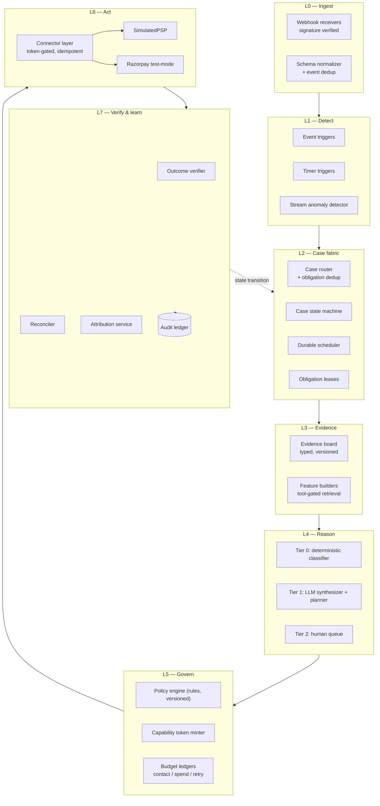

# Revenue Recovery Agent — Architecture v2

**Track:** Razorpay Buildathon, Track 03 — AI Revenue Recovery
**The bar:** measured money recovered across a batch, with compliant escalation, stopping rules, and an audit trail.
**Supersedes:** `payment-recovery-agent-concept.md` (v1)

---

## 0. What changed from v1

| # | v1 | v2 |
|---|---|---|
| 3a | ~20 LLM agents; decline-code analysis, fraud scoring, incident correlation all modelled as agents | **5 LLM call sites.** A deterministic Tier 0 resolves ~80% of cases; the model handles the residual, the explanation, and the copy |
| 3b | Policy gate sits between planner and executor | **Capability tokens.** The gate is the only minter; connectors refuse unsigned calls. Unbypassable by construction |
| 3c | No scheduler anywhere in the design | **Durable scheduler (L2)** is a first-class component — leased, exactly-once, cancellable, virtual-clock aware |
| 3d | "idempotency" and "coordinate" asserted | **Obligation lease + idempotency keys + contact-budget ledger + incident attachment**, all specified |
| 3e | Incident parks cases, resumption unspecified | **Release controller** with ramp, jitter, and circuit breaker; reroute gets canary + auto-rollback + TTL |
| 3f | "Rolling windows vs baseline" | **Seasonal per-segment baselines**, volume floor, two-proportion z-test, dwell, BH correction, auto-close, child-segment suppression |
| §4 | Global card vocabulary; Razorpay unmentioned | **India rails first-class**: UPI AutoPay, e-NACH, RBI e-mandate, AFA, pre-debit notification, DLT/TRAI, WhatsApp windows, Razorpay APIs |
| §5 | Attribution is one paragraph | **Attribution service** with stratified holdout and an incremental-recovery estimator as the headline metric |

---

## 1. Design principles

1. **Thin agent, thick policy.** The model earns its place where judgement is genuinely required. Everything a lookup table can answer is a lookup table — deterministic, cheap, and reproducible in the audit trail.
2. **Parallel proposal, serial execution.** Many components may investigate and propose concurrently; exactly one policy-approved plan executes against an obligation.
3. **Money moves only through a minted capability.** Not "the planner checked" — the connector physically cannot act without a signed, single-use token.
4. **Time is a first-class dependency.** Everything is scheduled: retries, chases, escalations, parks. The scheduler is infrastructure, not an afterthought.
5. **A rupee is only recovered when it is both collected and attributable.** Gross recovery is reported; incremental recovery against a holdout is the headline.

---

## 2. Layered architecture

Not an "agent mesh" — a layered pipeline where one layer's output is another's input, and each layer has a single responsibility.



**The dotted edge matters.** L7 writes the next state back to L2, which schedules the next action. That loop — not a chain of agents — is the product.

---

## 3. The decision ladder (fix 3a)

Every case enters at Tier 0 and escalates only if it must.

| Tier | Handles | Mechanism | Expected share | LLM cost |
|---|---|---|---|---|
| **Tier 0 — Resolve** | Known failure code, known rail, unambiguous policy | Decline taxonomy lookup → playbook → plan | ~75–85% | zero |
| **Tier 1 — Reason** | Unmapped code, conflicting evidence, multiple viable plans, customer reply to interpret | LLM synthesizer + planner + composer | ~12–20% | 1–3 calls |
| **Tier 2 — Escalate** | Low confidence, high value, novel action, policy requires approval | Human queue with expiry | ~3–5% | zero |

### Why this is the stronger AI story

The obvious question from a judge is *"why does this need an LLM at all?"* The ladder answers it with a number: the audit ledger records the tier for every case, so the demo can state **"the model changed the outcome on N of 300 cases — here are three of them"**, rather than asserting intelligence.

It also makes the audit trail reproducible. A Tier 0 decision cites a rule ID; replaying the ledger yields the identical plan. Only Tier 1 decisions carry model non-determinism, and those are the minority.

### What is deterministic (no model)

| Component | Implementation |
|---|---|
| Decline-code → cause + retry eligibility | Taxonomy table, per rail |
| Retry schedule | Rule: `(rail, code, attempt_no) → delay` |
| Fraud / risk gate | Threshold on the score you already have |
| Incident correlation | Graph query on the incident index |
| Recovery economics (EV) | `p_recover × value − action_cost − agent_cost` |
| Policy evaluation | Rules engine over case + customer + merchant config |
| Attribution | Two-proportion statistics |
| Contact eligibility | Budget ledger + consent + quiet-hours check |

---

## 4. The five LLM call sites

Each has a strict JSON schema (structured outputs via `output_config.format`), a bounded input, and no direct tool access to anything that moves money.

| # | Call site | Fires when | Model | Effort | Output |
|---|---|---|---|---|---|
| 1 | **Diagnosis synthesizer** | Tier 0 confidence < threshold, or evidence conflicts | `claude-sonnet-5` | `medium` | Ranked hypotheses, confidence, cited evidence IDs |
| 2 | **Recovery planner** | >1 eligible plan, or no playbook match | `claude-opus-5` | `high` | Ordered action IDs + params + stop conditions |
| 3 | **Message composer** | Any customer-facing copy | `claude-sonnet-5` | `low` | Template slot values, language `en`/`hi`/`hinglish` |
| 4 | **Incident RCA narrator** | Incident opened | `claude-opus-5` | `high` | Root-cause narrative + proposed system action |
| 5 | **Reply interpreter** | Inbound customer message | `claude-haiku-4-5` | — | Enum intent + extracted fields only |

### Routing rationale

- **Opus 5** ($5/$25 per MTok, 1M context) for the two judgement-heavy sites — plan selection and incident RCA — where a wrong call costs real money.
- **Sonnet 5** ($3/$15) for synthesis and composition: high volume, well-scoped, schema-constrained.
- **Haiku 4.5** ($1/$5) for reply classification — the highest-volume, lowest-judgement site.

Adaptive thinking is on by default on Opus 5; effort is the cost lever. `low`/`medium` are unusually strong on this generation, so start at the table above and sweep down against the eval set rather than defaulting everything to `high`.

### Prompt caching

Each call site has a frozen system prompt: role, the action library, the policy summary, the decline taxonomy. That prefix is stable across every case, so it caches. Opus 5's minimum cacheable prefix is **512 tokens** (down from 1024 on Opus 4.8), which most of these prompts clear comfortably.

Cache hygiene, because caching is a prefix match:
- Never interpolate case ID, timestamp, or merchant name into the system prompt — those go in the user turn, after the breakpoint.
- Serialize the action library deterministically (sort by ID). An unsorted `json.dumps` silently invalidates every cache entry.
- Keep the tool list identical across calls at a given site. Tools render at position 0; changing them invalidates everything.
- Verify with `usage.cache_read_input_tokens` — if it is zero across repeated cases, something in the prefix is varying.

### Prompt-injection posture

Call sites 3 and 5 touch untrusted text — inbound emails, WhatsApp replies, promise-to-pay messages. The rules:

- Inbound customer content is **data, never instruction**. It cannot lift a retry cap, unlock an action, change a policy, or alter the plan.
- Site 5 returns an **enum plus extracted fields**. It has no tool access and cannot emit an action. Its output is fed into the deterministic policy engine, which decides what happens.
- Site 3 fills **slots in an approved template**. It cannot author a free-form message, add a link, or change the recipient.
- Webhook signatures are verified at L0. A spoofed `payment_failed` is otherwise a free way to make the agent contact arbitrary customers.

### Degraded mode

If the model is unavailable or rate-limited, cases do not stall — money is on a clock. Tier 1 falls back to the Tier 0 default playbook for the rail, flags `degraded: true` in the ledger, and continues. The system fails **safe and collecting**, not stopped.

---

## 5. Governance: capability tokens (fix 3b)

A gate that only sits between the planner and the executor is advisory — anything holding a connector can route around it. So the gate is moved into the connector's admission check.

**The policy engine is the only minter.** Deterministic code, never a prompt.

```
CapabilityToken {
  case_id, obligation_id, action_id,
  params_hash, attempt_no,
  amount_cap, currency,
  policy_version, rule_id,
  not_after,             // short expiry
  nonce,
  hmac                   // signed with the gate's key
}
```

Connector admission, in order:

1. Verify HMAC and expiry.
2. Check `action_id` matches the call, and `params_hash` matches the actual params.
3. Check `amount ≤ amount_cap`.
4. **Burn the nonce** — insert into `token_burns` with a unique index. A duplicate insert means replay: reject.
5. Execute.

Steps 4 and 5 give idempotency and single-use enforcement from the same mechanism. The sentence this buys on stage: *"the agent cannot move money the policy engine did not authorise — not because it was instructed not to, but because the connector will not accept the call."*

**Approval expiry.** A Tier 2 case that no human touches within the SLA expires to `stopped_awaiting_human`. Never expire-and-execute.

---

## 6. Durable scheduler (fix 3c)

The whole product is time-based — retry at T+3, chase at T+7, escalate at T+14, park during an incident, resume after. This is the component most likely to break in a live demo, and it was absent from v1.

```sql
scheduled_actions (
  id, case_id, obligation_id,
  fire_at,                        -- virtual clock
  action_ref,
  state,                          -- pending | leased | done | cancelled
  lease_owner, lease_expiry,
  attempts, created_at
)
```

Tick worker:

```sql
SELECT * FROM scheduled_actions
WHERE state = 'pending' AND fire_at <= :now
ORDER BY fire_at
FOR UPDATE SKIP LOCKED
LIMIT 50;
```

- **Exactly-once**: lease acquisition and terminal-state write happen in one transaction. A crashed worker's lease expires and the row is re-picked.
- **Cancellable**: any terminal case transition cancels every pending row for that case in the same transaction. This is how a payment that succeeds on its own stops the dunning sequence.
- **Virtual clock**: `now` comes from a `Clock` interface. In production it is wall time; in the demo it is a controllable counter. This is what makes a 14-day dunning sequence run in 90 seconds on stage.

---

## 7. Idempotency and arbitration (fix 3d)

### The obligation is the unit of money

Not the case, not the customer. One obligation = one thing owed: a subscription cycle, an invoice, an order. Multiple cases and incidents may reference it; exactly one may act on it at a time.

### Obligation lease

Any actor must hold `obligation_lock(obligation_id, holder, expiry)` to execute. Fixes the v1 §4 race directly: `payment_failed` opens a case, the 20-minute abandonment timer fires and would open a second — but the dedup key is the **order/session**, not the customer, and the second case attaches to the first rather than opening.

### Idempotency key

```
idem_key = sha256(case_id | action_id | attempt_no | params_hash)
```

Written to `action_attempts` with a unique index **before** the external call; the response is written back after. On restart, any row still `in_flight` is reconciled by querying the PSP with the same key rather than re-issuing. This is what prevents a crash between call and response from double-charging.

### Contact budget ledger

Keyed `(customer_id, channel, window)`, decremented atomically, and — critically — **shared across every case and every incident**. This is the mechanism v1 gestured at when it worried about duplicate communications. Caps:

- per-channel per-window (e.g. 2 SMS / 7 days)
- global across channels per customer
- quiet hours (see §9)

### Incident attachment

A case joining an incident enters `suppressed_by_incident`. The **incident**, not the case, owns resumption. The case's pending scheduled actions are cancelled and re-created by the release controller on resume.

---

## 8. Incident mode

### 8a. Anomaly detection (fix 3f)

Naive rolling-window-vs-baseline fires on mix shift: a marketing push changes the issuer mix, aggregate approval rate drops, nothing is actually broken. The detector needs:

| Element | Specification |
|---|---|
| Segment key | `(gateway, method, issuer/bank, region, device)`, evaluated hierarchically |
| Baseline | Same weekday + hour, trailing 4 weeks, **per segment** — captures seasonality |
| Volume floor | `n ≥ 30` in window; below that, no test |
| Test | One-sided two-proportion z-test vs baseline; CUSUM in parallel for slow drift |
| Dwell | Must persist 2 consecutive windows before opening (hysteresis) |
| Multiplicity | Benjamini–Hochberg across the segment set — you are running hundreds of tests per tick |
| Child suppression | If a parent segment explains the drop, do not open child incidents |
| Auto-close | Rate within X% of baseline for 3 consecutive windows |

Razorpay also emits `payment.downtime.started` / `.resolved` webhooks — a real external signal to fuse with the internal detector, and a nice authenticity beat in the demo.

### 8b. Staged release and canary (fix 3e)

The failure v1 invites: a thousand parked cases resume at once against a gateway that just recovered, re-degrading it — and the detector fires again. Self-inflicted oscillation.

**Release controller:**
- Token-bucket resumption with jitter.
- Ramp `5% → 15% → 40% → 100%`, each step gated on live approval rate holding ≥ X% of baseline over a rolling window.
- Circuit breaker re-parks if the rate drops during ramp.

**Reroute action** — high blast radius, so it needs more than human approval:
- Canary percentage first.
- Automatic rollback if the backup path underperforms the primary.
- Kill switch.
- **TTL on the routing override** so nothing becomes permanent by forgetting.

---

## 9. India rails and compliance

This is where the track is judged and where v1 was silent — the word "Razorpay" did not appear in it once.

### Rails and their failure modes

| Rail | Distinctive failures | Retry semantics |
|---|---|---|
| Cards | Issuer decline, 3DS/OTP failure, expired card, invalid token | Soft vs hard decline; per-code ceilings; network rules limit retry counts and penalise excess |
| UPI collect / intent | Request expired, payer unavailable, PSP timeout | Short retry window; user must be present |
| **UPI AutoPay** | Mandate paused/revoked, balance insufficient, amount cap exceeded, payer app down | **Pre-debit notification required ≥24h before debit** |
| **e-NACH / e-mandate** | Mandate not active, presentation rejected, insufficient funds | Bank working-day presentation cycles; **no retry on revoked mandate** |
| Netbanking | Bank downtime, session expiry | Reroute, not retry |
| Wallets | Insufficient balance, KYC limit | Alternate method |
| Smart Collect (virtual accounts) | Unmatched inbound transfer | Reconciliation, not retry — key for B2B |

### Regulatory constraints, as policy config

- **RBI e-mandate**: AFA on registration and on debits above the configured threshold; pre-debit notification ahead of every debit. The mandate retry sequencer must schedule the *notification* before the *retry* — this is a named example direction in the brief and a clean demo beat.
- **Card network retry rules**: hard vs soft decline taxonomy, per-code retry ceilings.
- **TRAI / DLT** for SMS: registered header and template, DND scrubbing, no promotional traffic in restricted hours.
- **WhatsApp Business**: approved templates outside the 24-hour session window.
- **RBI recovery conduct**: contact-hour limits, identify yourself, honour opt-out.

All of these are **policy config with a version**, not code — because they differ per merchant and change over time, and the audit trail records which version authorised each action.

### Razorpay surface (test mode)

Orders, Payments, Payment Links, Subscriptions, Invoices, Smart Collect, Webhooks, Payment Downtime. Executing through these — real links, real webhook callbacks — is the difference between *"we designed a recovery agent"* and *"we recovered ₹X in test mode; here are the payment IDs."*

---

## 10. Attribution service

The bar says **measured** money recovered. This is the component that produces that number honestly, and it is the single most defensible thing in the build.

- **Holdout**: randomised at case creation (default 10%), stratified by cause and value band, assignment written immutably to the ledger.
- **Estimator**:
  `incremental = (recovery_rate_treated − recovery_rate_holdout) × treated_volume × mean_value_at_risk`
- **Window**: fixed per domain — 14 days for dunning, 48h for checkout, 30 days for invoices.
- **Exclusions**: payments recovered by the merchant's own existing dunning, and self-service customer retries occurring before first agent contact.
- **Normalisation**: a recovered renewal counts once as cash collected. It is *not* also counted as retained MRR in the headline; MRR is a breakdown, not an addend.
- **Reporting**: show gross and incremental side by side, clearly labelled. Being the team that knows the difference is the flex.

Metrics beyond the headline: recovery rate by cause / rail / issuer, approval-rate delta after an incident action, time to recovery, cost per rupee recovered (including model spend), contact volume per recovered rupee.

---

## 11. Case state machine

```
                    ┌──────────────┐
   event ──────────▶│   DETECTED   │
                    └──────┬───────┘
                           ▼
                    ┌──────────────┐
                    │  DIAGNOSING  │◀────────────┐
                    └──────┬───────┘             │
                           ▼                     │
                    ┌──────────────┐             │
              ┌────▶│   PLANNING   │             │
              │     └──────┬───────┘             │
              │            ▼                     │
              │     ┌──────────────┐             │
              │     │   AWAITING   │──expiry──▶ STOPPED_HUMAN
              │     │   APPROVAL   │             │
              │     └──────┬───────┘             │
              │            ▼                     │
              │     ┌──────────────┐             │
              │     │  EXECUTING   │             │
              │     └──────┬───────┘             │
              │            ▼                     │
              │     ┌──────────────┐             │
              │     │  OBSERVING   │─new evidence┘
              │     └──────┬───────┘
              │            ▼
              │     ┌──────────────┐
              └─────│  SCHEDULED   │  (next attempt queued)
                    └──────┬───────┘
                           │
     ┌─────────────────────┼─────────────────────┐
     ▼                     ▼                     ▼
 RECOVERED          UNRECOVERABLE          SUPPRESSED_BY_INCIDENT
 CANCELLED          DISPUTED               (incident owns resume)
 OPTED_OUT          STOPPED_HUMAN
```

Terminal states: `RECOVERED`, `UNRECOVERABLE`, `CANCELLED`, `DISPUTED`, `OPTED_OUT`, `STOPPED_HUMAN`. Every transition writes a ledger row with the rule ID and policy version that caused it.

Stopping rules from v1 §7 are unchanged and correct — they are now attached to explicit transitions rather than described in prose.

---

## 12. Data model (core tables)

```
merchants(id, name, policy_version)
customers(id, merchant_id, contact_prefs, consent_flags, language)
obligations(id, merchant_id, customer_id, type, amount, currency,
            due_at, external_ref, state)
cases(id, obligation_id, incident_id?, domain, state, tier,
      holdout_flag, opened_at, closed_at, terminal_reason)
evidence(id, case_id, kind, payload_json, source, observed_at)
diagnoses(id, case_id, cause_code, confidence, tier, rule_id?,
          model_id?, evidence_refs[])
plans(id, case_id, version, actions_json, stop_conditions_json, chosen_by)
capability_tokens(id, case_id, action_id, params_hash, amount_cap,
                  policy_version, rule_id, not_after, burned_at)
action_attempts(id, case_id, action_id, attempt_no, idem_key UNIQUE,
                state, request_json, response_json, sent_at, settled_at)
scheduled_actions(...)          -- §6
obligation_locks(obligation_id PK, holder, expiry)
contact_budgets(customer_id, channel, window_start, used, cap)
incidents(id, segment_key, opened_at, closed_at, state, rca_json)
incident_members(incident_id, case_id)
ledger(id, case_id, ts, actor, event_type, payload_json, policy_version)
attribution_runs(id, batch_id, treated_n, holdout_n, treated_rate,
                 holdout_rate, incremental_amount, window_days)
```

`ledger` is append-only and is the replay source. Replaying it must reproduce every Tier 0 decision exactly.

---

## 13. Security and data handling

- **PCI scope avoidance**: no PAN, no CVV, no raw card data anywhere. Tokenised references only. Customers update payment details through hosted Razorpay links — the agent never sees them.
- **PII at the prompt boundary**: redaction before any model call. The model receives identifiers and typed facts, not raw customer records.
- **Webhook signature verification** at L0, before anything is trusted.
- **Multi-tenancy**: policy is per-merchant and versioned; the ledger records `policy_version` on every authorised action.
- **Secrets** never in prompts or message history.

---

## 14. Product narrative

> When revenue is at risk, the agent detects it, diagnoses it against the actual rail — card, UPI AutoPay, or e-NACH — chooses an intervention its policy engine will authorise, executes it through a token-gated connector, and verifies whether money actually arrived. It respects retry ceilings, RBI mandate rules, DLT templates, consent, and quiet hours. And it reports what it recovered against a randomised holdout, so the number on the screen is the money the agent caused — not the money that would have arrived anyway.
